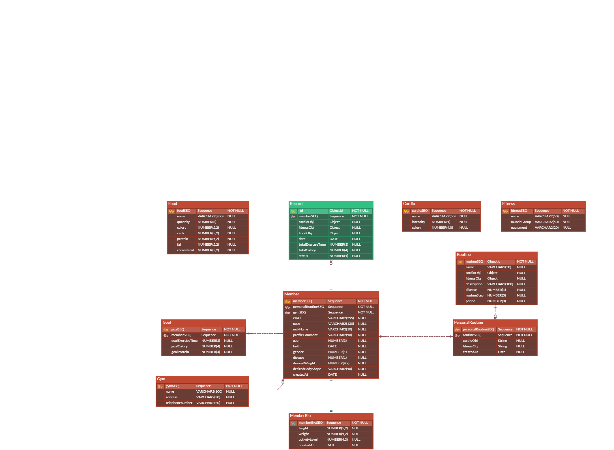
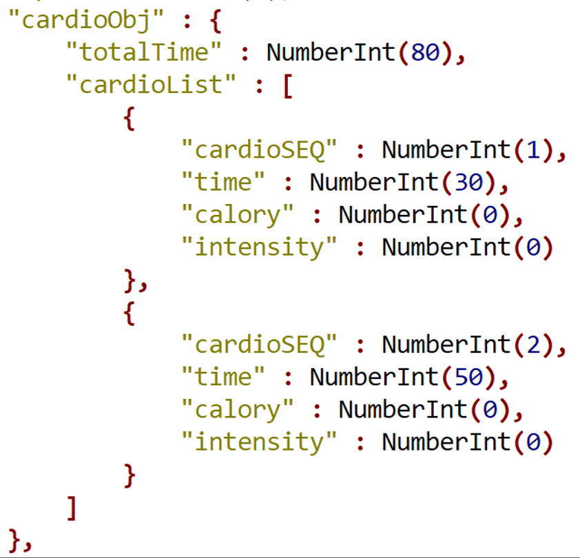

# 다루다 (다이어트와 루틴을 다루다)
* 운동과 식단 관리를 안 해 본 초보 사용자를 위한 서비스입니다. 
* 매일 운동량과 식단을 기록하여 권장 운동 루틴과 섭취 칼로리를 한눈에 확인할 수 있습니다.    
* [멀티캠퍼스 백엔드 개발자 취업캠프(Java) 2회차](https://event.multicampus.com/backend)의 최종 프로젝트를 위해 제작하였습니다. 

 

## 주요 정보
* <b>주요 기능</b>: 이 [파일](./readme/core_function.pdf) 참고 바랍니다.
* <b>제작 기간</b>: 2022.12.13 ~ 2023.01.26 (6주)
* <b>역할 분배</b>: 이 [파일](./readme/role.png) 참고 바랍니다.

 

## 기술 스택 
* Back-end
   * JAVA 8
   * Spring 4
   * Maven
   * MyBatis
   * Spring Data MongoDB
   * Jackson

 

* Database
   * Oracle
   * MongoDB 

 

* Front-end
   * Chart.js
   * Ajax
   * JSP
   * HTML/CSS/JavaScript

 

* ETC
   * Apache Tomcat 9
   * AWS EC2
   * GitHub

 

## ERD 

ERD 이미지

* 빨간색: Oracle / 초록색: MongoDB 
* Cardio와 Fitness는 각각 유/무산소 운동을 저장하는 테이블로서, Routine 테이블의 cardioObj/fitnessObj 필드와 관계를 맺습니다.

cardioObj 예시

 

## 주요 소스 코드
* 회원 가입 시 Member, MemberBio, PersonalRoutine, Goal 테이블에 모두 정상적으로 데이터가 입력되어야 하므로 Transaction을 이 [코드](https://github.com/flyc4/drd/blob/34eab38c68c0bf0e3061cc0413efb39769085150/drd/src/main/java/com/multi/drd/member/MemberServiceImpl.java#L35)에 사용하였습니다. (작성자: 김창희)
* MongoDB에 저장된 기록을 토대로 사용자의 주(week)별 운동 시간을 이 [코드](https://github.com/flyc4/drd/blob/34eab38c68c0bf0e3061cc0413efb39769085150/drd/src/main/java/com/multi/drd/dashboard/DashboardDAOImpl.java#L118)를 통해 계산하였습니다. (작성자: 박수정)

 

## 후기

### 배운 점

- 프로젝트 기획은 **명확**해야 합니다.
- ERD, 기능 등의 **설계를 실수 없이** 해야 합니다.
- 자료 조사는 중요하지만, **그 기간을 무한대로 잡으면 안 됩니다.** 프로젝트 기간이 지연되며 집중도가 떨어집니다.
- **두 가지 이상의 데이터베이스 사용은 생각보다 어렵습니다.**
    - 도입을 좀 더 신중히 고려해야 합니다.
    - 특히, 데이터베이스 간에 데이터를 공유할 때는 개발의 난이도가 급상승하므로 더욱 신중해야 합니다.

### 잘한 점

- 다 같이 의견을 제시하면서 기능을 확장하였습니다. 덕분에 **주제 선정에 모두가 쉽게 동의**할 수 있었습니다.
- 초보자의 운동 루틴, 권장 섭취 칼로리와 단백질량 등을 제시하는 **근거가 명확**합니다.
- 각자 다른 폴더에서 작업하였기에 **Git 충돌 문제가 적었습니다.**
- 대시보드, 기록을 통해 권장 섭취량 변경 등 **핵심 기능을 구현**하여 무사히 발표를 마칠 수 있었습니다.

### 아쉬운 점

  
프로젝트 기간이 절 반 정도 남은 시점에 <b>기획을 바꾸었습니다.</b>

   
  <ul>
    <li>변경 전:  BMI, 운동 목적, 운동 부위 별 맞춤 루틴 추천</li>
    <li>변경 후: 초보자를 대상으로 한 <b>기본 운동 루틴 추천</b></li>
    <li>변경 일자: 1/9 (프로젝트 종료일: 1/26)</li>
    <li>
      변경 사유
      <ul>
        <li>모든 팀원이 루틴 및 식단 추천 관련 자료를 찾기 위해 <b>일주일(전체 프로젝트의 1/6)을 투자</b>했지만, 루틴 및 식단에 관한 <b>자료가 부족</b>하였습니다.</li>
        <li>멘토링 때 서비스 성격이 모호하다는 피드백을 받았습니다.</li>
      </ul>
    </li>
  </ul>
   

  
기획 수정 후에도 <b>관련 문제가 발생</b>했습니다.

   
  <ul>
    <li>기능, 화면, ERD 등을 <b>급하게 재설계하느라 많은 실수가 발생</b>했습니다.</li>
    <li>
      <b>단기간에 수행하기에는 서비스가 복잡</b>하였습니다.
      <ul>
        <li>사용자는 회원 가입 시 루틴이 자동 할당 및 갱신됩니다.</li>
        <li>기록할 때는 할당 받은 루틴에 관계 없이 본인이 수행한 운동을 기록할 수 있습니다.</li>
        <li>즉, 할당된 루틴의 생성과 갱신, 일 별 운동 기록을 별도로 관리해야 합니다.</li>
      </ul>
    </li>
  </ul>
   

  
Oracle과 MongoDB가 혼재되어 <b>구조가 복잡하였습니다.</b>

   
    

      
ERD

      
    

  <ul>
    <li>여러 유/무산소 운동을 저장하는 <b>사용자별 루틴 (PersonalRoutine): Oracle</b></li>
    <li>일 별 <b>운동 기록 저장 (Record): MongoDB</b></li>
    <li>두 테이블에 데이터를 일관된 형태로 저장하기 위해 <b>JSON을 활용</b>하였습니다.</li>
    <li>Oracle에는 JSON을 저장할 수 없기에 문자열로 변환한 후 저장하였습니다. 문자열 내 운동 추가, 변경, 삭제하는 과정이 어려웠습니다.</li>
    <li>부트 캠프 동안 배웠던 Oracle과 MongoDB를 동시에 사용하고 싶어서 위와 같은 설계를 하였습니다.</li>
  </ul>
   

        

  
MongoDB에서 <b>주 단위의 데이터를 Aggregation</b>하는 것이 어려웠습니다.

   
  <ul>
    <li>Record Document에서 1주일 단위의 데이터를 Aggregation 한 후 주간 기록을 바탕으로 통계를 작성해야 했습니다.</li>
    <li>담당 팀원은 프로젝트 대부분의 시간을 이 작업에 할애하였습니다.</li>
  </ul>

 

## 참고 자료
* 초보자의 운동 루틴: 2015 보건복지부 우수건강도서로 선정된 [헬스의 정석](http://www.hanmunhwa.com/?p=4811)
* 하루 권장 섭취 칼로리: [2015 한국인 영양소 섭취기준 활용 가이드북](https://www.dietitian.or.kr/assets/ver2/bogun_online_2016/html/main_popup/2015%ED%95%9C%EA%B5%AD%EC%9D%B8%EC%98%81%EC%96%91%EC%86%8C.pdf) (22쪽)
* 일주일 권장 섭취 단백질: [Tarnopolsky M. Protein requirements for endurance athletes. Nutrition. 2004 Jul-Aug;20(7-8):662-8. doi: 10.1016/j.nut.2004.04.008. PMID: 15212749.](https://pubmed.ncbi.nlm.nih.gov/15212749/)
